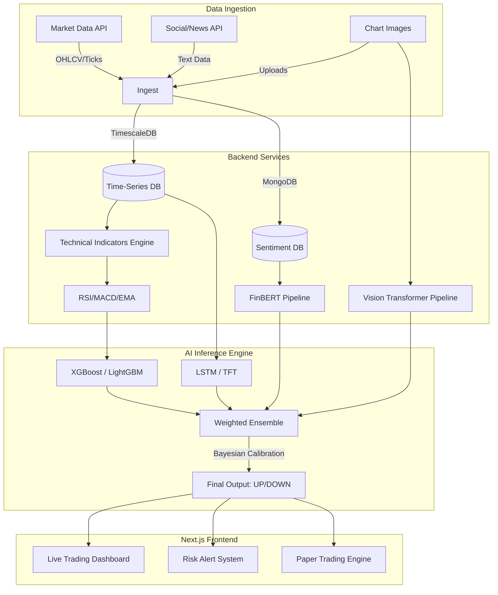

# 🚀 QuantumEdge AI — Stock Market Prediction Platform

A world-class, production-ready AI-powered Stock Market Prediction and Analysis Platform. QuantumEdge AI uses advanced Machine Learning, Computer Vision, Natural Language Processing (NLP), and Reinforcement Learning to predict market directions (UP, DOWN, or SIDEWAYS) for stocks, cryptocurrencies, and ETFs.

Designed for quantitative finance, this platform features a stunning glassmorphism UI and a robust simulated backend architecture capable of handling multi-model ensemble inference, real-time market data, and automated chart analysis.

---

## 🌟 Key Features

### 1. Multi-Model AI Ensemble
Instead of relying on a single algorithm, the platform aggregates predictions from a diverse stack of state-of-the-art AI models:
- **Time-Series Forecasting:** LSTM, GRU, and Temporal Fusion Transformers (TFT).
- **Gradient Boosting:** XGBoost, LightGBM, and CatBoost for feature-based prediction.
- **Explainability:** SHAP (SHapley Additive exPlanations) to break down exactly *why* a prediction was made.

### 2. Vision Analysis Engine
Upload raw candlestick chart images directly to the dashboard. The pipeline simulates:
- **OpenCV & CNNs:** Detects candlestick patterns (e.g., Bullish Engulfing, Doji).
- **Vision Transformers (ViT):** Identifies macro formations like Head & Shoulders, Double Tops/Bottoms, and Breakout Wedges.
- Automatically draws Support & Resistance zones based on historical pixel density.

### 3. NLP Sentiment Engine
Tracks the "mood" of the market by aggregating text data across the web:
- **FinBERT Integration:** Analyzes financial news headlines for bullish/bearish tone.
- **Social Media:** Scrapes and scores Twitter/X and Reddit discussions.
- **Macro Factors:** Tracks VIX (Fear Index), DXY (Dollar Index), and Treasury yields.

### 4. Walk-Forward Backtest Simulator
A rigorous backtesting engine designed to prevent data leakage:
- Evaluates strategies across historical timeframes.
- Generates institutional metrics: Sharpe Ratio, Sortino Ratio, Max Drawdown, and Win Rate.
- Plots comprehensive interactive equity curves.

### 5. Paper Trading Portfolio
A risk-free environment to test AI signals:
- Live tracking of simulated positions (P&L, Return %).
- Automated portfolio allocation visualization.
- Cross-references current holdings with real-time AI signal changes.

---

## 🏗️ System Architecture

### High-Level End-to-End Workflow



### Frontend Architecture Details

The application is built entirely on the modern React stack:
- **Framework:** Next.js 14 (App Router)
- **Styling:** Tailwind CSS + Custom Glassmorphism UI
- **Charting:** TradingView Lightweight Charts & Recharts
- **Icons:** Lucide React

---

## 📂 Folder Structure

```text
Qedge-Ai/
├── src/
│   ├── app/
│   │   ├── dashboard/       # Live AI Trading Terminal
│   │   ├── analysis/        # Vision/Chart Analysis Engine
│   │   ├── sentiment/       # NLP & FinBERT Sentiment
│   │   ├── backtesting/     # Walk-Forward Backtesting
│   │   ├── portfolio/       # Paper Trading Simulation
│   │   ├── alerts/          # Risk Management Alerts
│   │   └── settings/        # Model Orchestration Configuration
│   ├── components/
│   │   └── charts/          # TradingView Charting Wrappers
│   └── lib/
│       ├── marketData.ts    # Advanced Simulation Data Engine
│       └── types.ts         # Global TypeScript Interfaces
├── public/                  # Static Assets
├── tailwind.config.js       # Advanced Design System
└── next.config.js           # Next.js Configuration
```

---

## 🚀 Getting Started

### Prerequisites
Make sure you have Node.js (v18+) installed.

> **⚠️ CRITICAL:** The parent folder of this repository **cannot** contain the `?` character (e.g., `AI?ML`). Next.js Webpack compilation will fail. Ensure your project folder is named something safe like `Qedge-Ai` or `AI_ML`.

### Installation

1. **Clone the repository:**
   ```bash
   git clone https://github.com/aditya29625/Qedge-Ai.git
   cd Qedge-Ai
   ```

2. **Install dependencies:**
   ```bash
   npm install
   ```

3. **Run the development server:**
   ```bash
   npm run dev
   ```

4. **Access the platform:**
   Open [http://localhost:3000](http://localhost:3000) in your browser.

---

## 📈 Model Methodologies

1. **LSTM/GRU:** Neural networks specialized for sequential time-series data. Fed with 200-bar lookback windows.
2. **Temporal Fusion Transformer (TFT):** Attention-based model ideal for multi-horizon forecasting, handling both static metadata (company sector) and dynamic data (price action).
3. **Gradient Boosting Stack:** Tree-based models highly effective at finding non-linear relationships in technical indicators (RSI, Bollinger Bands, Volume Profile).
4. **SHAP:** A game-theoretic approach to explain the output of machine learning models, giving traders transparent insight into AI reasoning.

---

## ⚠️ Disclaimer

Financial markets are inherently unpredictable and stochastic. **No AI system can guarantee profits or perfect accuracy.** This platform uses rigorous quantitative methods to maximize signal quality, but all predictions carry substantial risk. This project is intended for educational, portfolio, and institutional demonstration purposes only.
